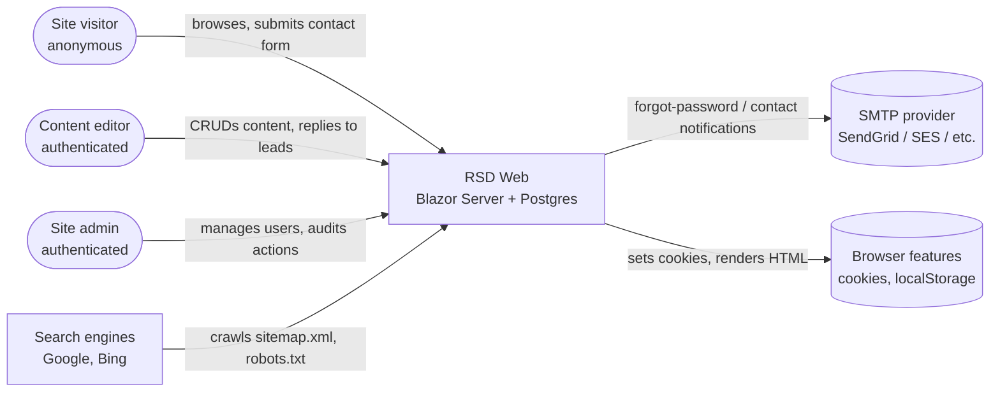
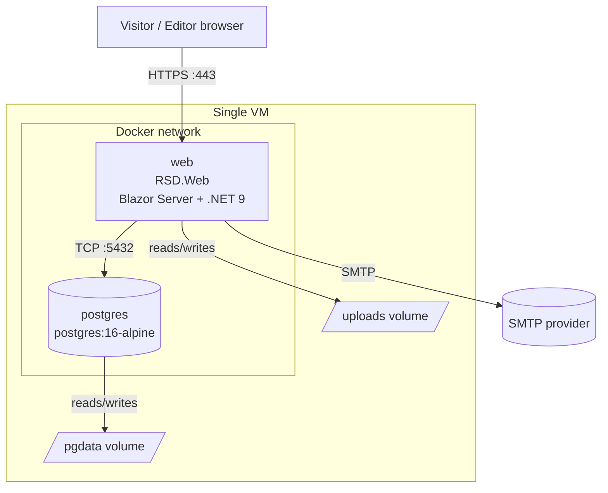
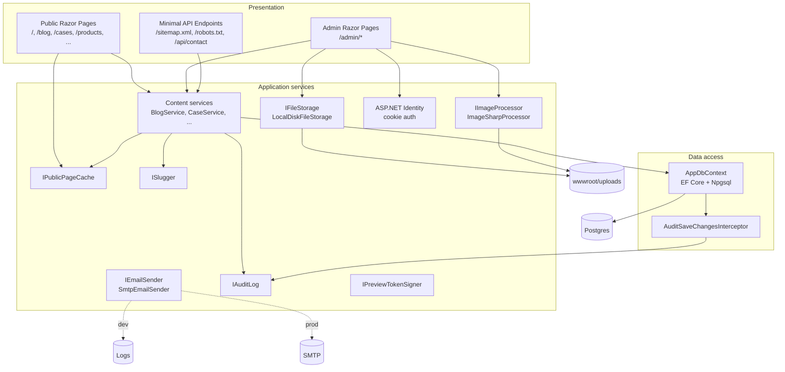
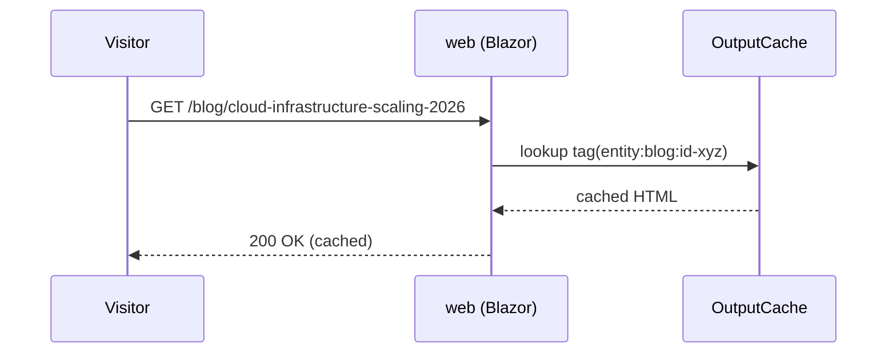
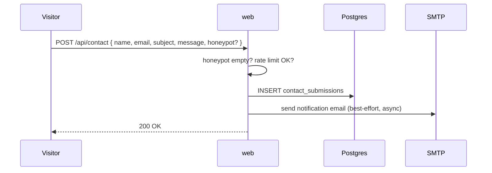
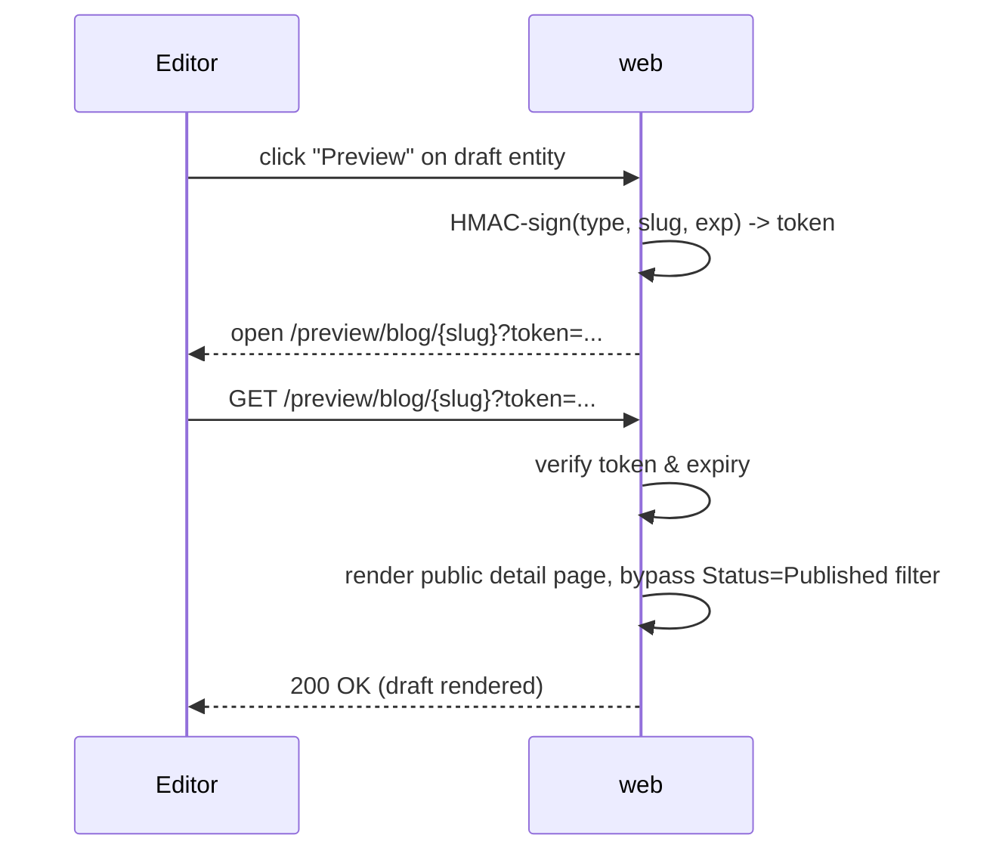
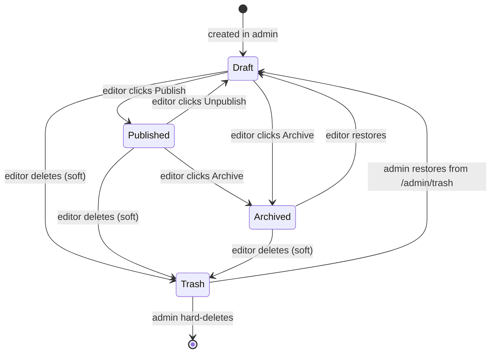
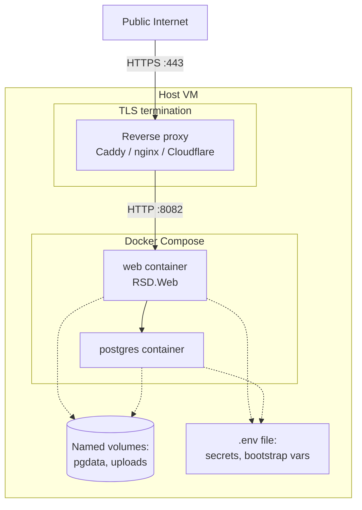

# RSD — System Architecture

**Version:** 1.0
**Date:** 2026-05-12
**Status:** Draft for review
**Owner:** Mark Podlyashetskyi

This document describes the architecture of the RemSoft.Dev marketing website (`RSD.Web`) — the public-facing site plus the upcoming authenticated admin panel and Postgres-backed content store. It is the high-level view; implementation-level detail lives in [`docs/superpowers/specs/2026-05-12-backend-and-admin-design.md`](../docs/superpowers/specs/2026-05-12-backend-and-admin-design.md).

---

## 1. Purpose and scope

RSD is RemSoft.Dev's primary marketing site. It exists to:

- Present the company, its services, products, case studies, blog posts, and team to prospective clients.
- Let a small marketing/leadership team (currently ~1–5 people) keep that content fresh without involving developers for every change.
- Capture inbound leads via a contact form and route them to the team's inbox.

In scope for this architecture document:

- Public website (HTML pages, SEO, performance, accessibility).
- Authenticated admin panel for content CRUD.
- Content store and file storage for editor-uploaded media.
- Email integration for forgot-password, user invites, and contact-form notifications.

Out of scope (explicit non-goals):

- Multi-tenant SaaS hosting (this is a single-tenant marketing site).
- Multi-language / localization (English-only).
- Public REST/GraphQL API for third-party consumers.
- E-commerce, payment processing, account self-service for site visitors.

## 2. Quality attributes (what "good" looks like)

| Attribute | Target |
|---|---|
| Performance — public page TTFB | < 200 ms warm cache, < 500 ms cold |
| Performance — public Lighthouse score | ≥ 90 in all categories on every page |
| Availability | "Best effort" — single container, single VM is acceptable for v1; downtime during deploys is acceptable |
| Scalability | Vertical only for v1; one container handles expected traffic (low thousands of daily visitors) |
| Security | OWASP Top 10 hygiene; admin behind auth; uploads sanitized; secrets from env, never repo |
| Accessibility | WCAG 2.1 AA on public and admin |
| SEO | Server-rendered HTML, semantic markup, OG meta, auto sitemap.xml, fast LCP |
| Maintainability | One developer can hold the whole system in their head; conventions enforced by `CLAUDE.md` |
| Operability | Single `docker compose up` brings the whole system up locally and in prod |

These attributes shape every other decision in this document.

## 3. System context

The system has three classes of human actor and a small set of external systems.



**Notes:**

- "Editor" and "Admin" are not distinct roles in v1 — everyone with a login is an Admin. The distinction is shown here because we may add roles in the future.
- The SMTP provider is **abstracted behind `IEmailSender`**; the production binding is chosen at deploy time, not in code.

## 4. Container view

The deployed system consists of two containers in a Docker Compose stack on a single VM.



**Why this shape:**

- **One Blazor process** hosts both the public site and the `/admin/*` routes. Simplest possible deploy; same runtime for both, services injected once.
- **Postgres in its own container** for storage isolation, easy backups (snapshot the volume), and parity with prod in local dev.
- **Two volumes**: `pgdata` for the DB; `uploads` mounted at `/app/wwwroot/uploads` for editor-uploaded files. Both survive container rebuilds.
- **No reverse proxy in scope** for this document — we assume the host VM or platform terminates TLS upstream of the `web` container (Caddy, nginx, Cloudflare Tunnel, fly.io edge, etc.).

## 5. Component view (inside `web`)

The `web` container is one ASP.NET Core process hosting Blazor Server. Internally it is organized as follows:



**Layering rules:**

- Razor pages talk to services. They never talk to `AppDbContext` directly.
- Services talk to `AppDbContext` and to one another. They never talk to Razor components.
- Cross-cutting concerns (`Audit`, `Cache`) are wired via interceptors and service-layer hooks, not sprinkled into every Razor handler.
- Pure functions (formatting, slug generation, diff serialization) are static helpers — testable without DI.

## 6. Technology stack and rationale

| Concern | Choice | Why |
|---|---|---|
| Runtime | .NET 9 | Latest LTS-track; primary-constructor DI, collection expressions, `required` — keep the codebase at the modern edge as `CLAUDE.md` mandates. |
| Web framework | ASP.NET Core + Blazor Server (interactive) | Server-side rendering for SEO, real-time interactivity for the admin, no SPA build pipeline to maintain. |
| Database | PostgreSQL 16 | OSS, mature `jsonb` for typed-body storage, excellent EF Core support via Npgsql. |
| ORM | Entity Framework Core 9 | First-party, codified migrations, `SaveChangesInterceptor` enables global audit without per-service boilerplate. |
| Identity | ASP.NET Core Identity (EF Core store) | Standard; cookies; password reset, lockout, hashing handled by the framework. |
| CSS / UI | Tailwind 4 + Flowbite | Already in place for the public site; admin reuses the same primitives for visual coherence and zero extra dependencies. |
| Rich-text editor | Quill (JS interop) | OSS, simple Blazor JS-interop story, emits semantic HTML that we sanitize server-side. |
| HTML sanitization | Ganss.Xss | Industry-standard whitelist sanitizer; configurable for SVG too. |
| Image processing | SixLabors.ImageSharp | OSS, no native deps, generates WebP variants at small/medium/large. |
| Email | `IEmailSender` abstraction; `SmtpEmailSender` in prod, `LoggingEmailSender` in dev | Concrete provider chosen at deploy time; no code coupling to a specific vendor. |
| Output cache | ASP.NET Core OutputCache (in-memory) | Built in to .NET; tag-based invalidation; sufficient for one container. |
| Containerization | Docker + Compose | Already in place; one command brings up the whole stack locally and in prod. |
| Testing | xUnit + Testcontainers (Postgres) + Bunit | xUnit for unit/integration; Testcontainers gives real-DB parity; Bunit for Razor component logic. |

**Rationale themes:**

- Prefer first-party Microsoft components over third-party libraries unless there's a clear reason. Reduces dependency surface.
- Prefer **abstractions at the seams** (`IFileStorage`, `IEmailSender`, `IPublicPageCache`) so we can swap implementations without touching call sites.
- Prefer **server-rendered HTML** for everything reachable by a search engine — SEO is a primary requirement.

## 7. Key flows

### 7.1 Anonymous visitor reads a published blog post (cache hit)



Cache TTL is 10 minutes by default. On miss, the page is rendered, then stored against `entity:blog:{id}` and `list:blog` tags.

### 7.2 Editor publishes an edited blog post

```mermaid
sequenceDiagram
    participant E as Editor
    participant W as web
    participant DB as Postgres
    participant I as AuditInterceptor
    participant Cache as OutputCache

    E->>W: POST /admin/blog/{id} (save & publish)
    W->>W: validate, sanitize HTML, generate slug
    W->>DB: BEGIN; UPDATE blog_posts SET ... ; INSERT audit_log_entries ...
    DB->>I: SaveChanges hooks
    I->>DB: audit row written in same tx
    DB-->>W: COMMIT
    W->>Cache: EvictByTagAsync(entity:blog:{id}, list:blog)
    W-->>E: 200 OK (toast: published)
```

Audit is written **in the same database transaction** as the entity change — they cannot drift.

### 7.3 Visitor submits the contact form



Honeypot field + per-IP rate limit are the v1 spam defenses. Submissions are durable in the DB even if SMTP fails.

### 7.4 Editor previews a draft



The signing key lives in config (`Preview:SigningKey`, from env). Rotating it instantly invalidates all outstanding preview URLs.

## 8. Data architecture

### 8.1 Content workflow

Every content entity has a status:



**Visibility rules:**

- Public pages query `Status == Published && !IsDeleted`.
- Admin list pages query everything except `IsDeleted`, with status filter chips on top.
- `/admin/trash` queries `IsDeleted == true` only, via `IgnoreQueryFilters()`.
- `/preview/{type}/{slug}` queries any status (including Draft) when the HMAC token validates.

### 8.2 Content shape — typed vs flexible

The site has two visually distinct categories of detail page:

- **Fixed-template details (Case, Product)** — the design has named, structured zones (badges, hurdles, results, metrics, tech pills, etc.). These are modeled as **strongly-typed C# records serialized to a `jsonb` column**. Admin form is a series of named field groups; the schema cannot drift from what's renderable.
- **Article-style details (Blog, Service)** — the body is a flowing article with optional sub-blocks. These are modeled as an **ordered list of polymorphic blocks** (subsection, stats row, gallery, bullet list, quote, image, rich-text), also stored as `jsonb`. Admin uses a block-list editor with reorder and a typed palette.

Both approaches keep the entire entity in one row and one transaction. Neither uses a sprawl of join tables.

### 8.3 File storage

All editor uploads land at `wwwroot/uploads/{entity}/{yyyy}/{mm}/{guid}-{size}.{ext}`. ImageSharp emits three WebP variants on upload (small 480, medium 1024, large 1920); the original is preserved for reprocessing. SVGs are sanitized and stored unchanged. A `UploadedFiles` row tracks every file with a reference count maintained at the service layer — hard delete is blocked while the count is non-zero. The path `wwwroot/uploads/` is mounted as a Docker volume; the public site serves these via `MapStaticAssets()`.

## 9. Cross-cutting concerns

### 9.1 Authentication and authorization

- ASP.NET Identity, cookie auth, `HttpOnly` + `Secure` + `SameSite=Lax`, sliding expiration 30 days.
- Default Microsoft password policy. Lockout 5 / 15 min.
- Single `Admin` role enforced at `AdminLayout` via `[Authorize(Roles = "Admin")]`.
- First admin bootstrapped from env vars on empty DB.
- All admin actions executed in the context of the logged-in user (captured in audit log).

### 9.2 Caching

- In-memory `OutputCache` with tag-based invalidation. Tags: `entity:{type}:{id}` and `list:{type}`.
- Public pages tag their output; content services evict on save/publish/unpublish/delete.
- TTL configurable; default 10 minutes.
- Single-container deployment makes in-memory cache the right choice for v1; revisit if we ever run multiple instances.

### 9.3 Audit

- `AuditSaveChangesInterceptor` writes one `AuditLogEntries` row per affected entity inside `SaveChanges`, in the same DB transaction as the change.
- Minimal JSON diff (changed fields only, before/after).
- Read-only admin view at `/admin/audit` with filters by user/type/action/date.

### 9.4 Validation and sanitization

- Input validation: server-side data annotations + service-layer business rules; client-side hints in Blazor forms are convenience only.
- HTML sanitization: every HTML-bearing field (rich-text intros, rich-text blocks, two-column conclusions) passes through `Ganss.Xss` before persistence.
- SVG sanitization: dedicated `Ganss.Xss` SVG profile strips scripts, foreign objects, and external refs.
- File upload validation: allowed content types, max size, magic-number sniffing (not just extension trust).
- Slug uniqueness: per-table partial unique index on `Slug WHERE NOT IsDeleted`, plus pre-save service-layer check with friendly inline error.

### 9.5 Observability

- Structured logging via `ILogger<T>` throughout; format JSON in production for log aggregation.
- Request logging at INFO; service-layer warnings at WARN; exceptions at ERROR with full stack.
- Audit log doubles as a domain-level event stream.
- Out of v1 scope: distributed tracing, APM, custom metrics. The architecture leaves room for OpenTelemetry exporters to be added later without touching application code.

### 9.6 Security baseline

- HTTPS terminated by upstream reverse proxy; HSTS enabled in non-development environments (already wired).
- Antiforgery tokens on all state-changing requests (`app.UseAntiforgery()` already in place; Blazor adds its own).
- Secrets exclusively from environment variables in production; never in `appsettings.json` checked into git.
- Uploaded HTML/SVG always sanitized server-side; no client-side trust.
- No third-party scripts on public pages by default (no analytics, no embedded chat) — opt-in only.
- Content-Security-Policy header to be tightened in Phase 5 (out of v1 critical path).

### 9.7 Accessibility

- Semantic HTML5 + WAI-ARIA mandated by `CLAUDE.md`.
- Tailwind/Flowbite components used in admin all support keyboard navigation and screen readers; verified during component review.
- All admin form fields have visible labels and programmatic associations.
- Color contrast: every admin and public color combination meets WCAG AA.

## 10. Deployment view



**Deployment lifecycle:**

- `git pull && docker compose up -d --build` is the deploy step.
- EF Core migrations run automatically on container start (`Database.Migrate()` before app builds the request pipeline).
- Idempotent seed runs after migrations on empty DB.
- Brief downtime during container rebuilds is acceptable for v1.

**Backups (operational, documented separately):**

- `pg_dump` of the `rsd` database on a schedule (host cron).
- Tar+rsync of the `uploads` volume on a schedule.
- Both restorable independently.

## 11. Architectural decisions (compact ADR-style)

Each decision below has the form *Decision · Why · Alternatives considered · Implication*.

### ADR-001 — Single Blazor Server process for both public and admin

- **Decision:** Public site and `/admin/*` admin panel are served from the same ASP.NET Core process.
- **Why:** Single deploy, shared services, no inter-service contracts, minimal operational surface.
- **Alternatives:** Separate `RSD.Admin` project on its own subdomain; SPA admin against a `/api` backend.
- **Implication:** Heavy admin work shares the same process as public traffic; mitigated by output caching and the fact that admin load is from a handful of users, not the public.

### ADR-002 — PostgreSQL with EF Core, `jsonb` for structured bodies

- **Decision:** Postgres is the system of record; structured detail bodies (Case/Product fixed fields, Blog/Service article blocks) live in `jsonb` columns on the parent row.
- **Why:** Editing the whole detail page is atomic, no 10-way join table sprawl, schema-on-read flexibility for blocks. Postgres `jsonb` is fast enough at this scale.
- **Alternatives:** Fully normalized join tables per block type; document DB (MongoDB); flat columns for every typed field (rigid).
- **Implication:** Block schema evolution requires a JSON-data migration when shape changes; mitigated by polymorphic discriminator field and forward-compatible deserialization.

### ADR-003 — Local-disk file storage behind `IFileStorage`

- **Decision:** Uploads go to a mounted Docker volume; `IFileStorage` abstraction so we can swap to S3/Azure Blob without touching call sites.
- **Why:** Zero cloud dependency; backups are file-level; cheapest possible storage.
- **Alternatives:** Azure Blob / S3 from day one; in-DB BLOBs.
- **Implication:** Disk is single-VM scoped; horizontal scaling out of v1 scope. Swap is a one-class change when needed.

### ADR-004 — Hybrid content model (typed fields vs block list)

- **Decision:** Case and Product detail pages use a fixed typed schema; Blog and Service detail pages use an ordered block list. Header data is always typed.
- **Why:** Cases and Products have brand-defining visual treatments where editor freedom would hurt design consistency. Blog/Service are articles where flexibility wins.
- **Alternatives:** Strongly-typed everywhere (rigid, every section type needs a migration); blocks everywhere (admin UX heavier, design discipline harder).
- **Implication:** Two distinct admin editing patterns (`RepeaterField<T>` for typed, `BlockListEditor` for blocks).

### ADR-005 — In-process services, no internal API

- **Decision:** Razor pages call services directly via DI; no internal HTTP/gRPC API.
- **Why:** One process, no serialization tax, full type safety, primary-constructor DI matches `CLAUDE.md` conventions.
- **Alternatives:** Minimal API exposed for internal use; gRPC.
- **Implication:** If we ever split admin and public into separate processes, service interfaces will need an HTTP veneer — but they're already shaped as classes-with-methods, so the lift is mechanical.

### ADR-006 — Audit via `SaveChangesInterceptor`, not per-service code

- **Decision:** A single EF Core interceptor captures all entity changes and writes audit rows in the same transaction.
- **Why:** Zero per-service boilerplate, cannot drift from real changes, atomic with the modification.
- **Alternatives:** Audit at the service layer (boilerplate); event sourcing (over-engineered).
- **Implication:** Audit shape is centralized; cannot capture business-level intent ("user clicked Publish") beyond what's in the entity diff. We extend the interceptor to mark status transitions as semantic actions where useful.

### ADR-007 — Quill for rich text, server-side HTML sanitization

- **Decision:** Quill on the client for WYSIWYG editing; `Ganss.Xss` sanitizes on every save.
- **Why:** Most familiar editor UX for non-technical users; sanitization at the trust boundary, never on the client.
- **Alternatives:** Markdown (less friendly); TipTap (heavier JS build); TinyMCE (licensing).
- **Implication:** JS interop for the editor; documented sanitization profile that admins know the boundaries of.

### ADR-008 — Output cache in-process

- **Decision:** ASP.NET Core OutputCache with in-memory store, tag-based invalidation.
- **Why:** One container makes in-memory the simplest correct choice; tag invalidation makes saves predictable.
- **Alternatives:** Redis (more infra), CDN-edge cache (operational complexity).
- **Implication:** Cache is lost on container restart; acceptable. If we go multi-instance, swap the store for Redis with no API change.

## 12. Constraints and risks

| Risk / constraint | Mitigation |
|---|---|
| **Single VM, single process** — downtime during deploys; no failover. | Acceptable for v1 marketing site traffic. Documented rollback procedure (`docker compose down && git checkout PREV && docker compose up -d`). |
| **In-memory cache lost on restart** — first request after deploy is slower. | TTL is short anyway; cold-cache latency budget < 500 ms; acceptable. |
| **`jsonb` body schema drift** — code expects fields that older rows lack, or vice versa. | Forward-compatible deserialization (ignore unknown fields, default missing); data migrations scripted and committed alongside the code change. |
| **Editor uploads HTML/SVG that contains a payload** — XSS. | Server-side `Ganss.Xss` on save, including SVG profile. Public pages render sanitized output only. |
| **Lost backups** — DB or uploads corruption. | Documented backup recipe in ops README (out of architecture scope but called out). |
| **Conventions drift** (records become classes, nullables creep in, CC creeps up). | `CLAUDE.md` enforced in code review; analyzers where practical. |
| **Single admin role** — anyone with credentials can do anything. | Acceptable for v1 small-team scope. Roles are a clear later extension. |
| **Preview tokens leaked** (e.g. by sharing the URL). | Short TTL (1 hour); rotate `Preview:SigningKey` invalidates all outstanding tokens immediately. |

## 13. Evolution path

The architecture is designed so that each of the following is an **additive** change rather than a rewrite. None of them are scoped for v1.

| Future change | What it touches |
|---|---|
| **Localization** | Add per-locale columns or a translation table for translatable fields; locale routing in `Program.cs`; locale switcher in admin. The `ContentEntity` base does not change. |
| **Scheduled publishing** | Add `PublishAt`; a `PeriodicTimer`-driven background service flips `Status` at the appointed time. No schema rewrite. |
| **Slug redirects** | New `SlugRedirects` table; lookup middleware in front of the public route resolver. |
| **Granular roles** | Add roles via Identity; `[Authorize(Roles = "...")]` on admin pages; service-layer checks for fine-grained ops. |
| **SSO / OIDC** | ASP.NET Identity supports OIDC providers via package installation and `Program.cs` wiring. No app-level changes. |
| **Public API** | Add a `Controllers/` or minimal-API layer that calls the same services. Versioned route prefix. |
| **Horizontal scale** | Swap `OutputCache` store to Redis; `IFileStorage` to S3/Azure Blob; introduce sticky sessions for Blazor Server *or* migrate the admin to Blazor WebAssembly (public stays server-rendered for SEO). |
| **Observability** | Add OpenTelemetry exporters; no application code changes required. |
| **CDN** | Put a CDN in front of static assets and cached public pages; output cache headers and ETags already support this. |

## 14. References

- Implementation specification with phases, schemas, and per-component contracts: [`docs/superpowers/specs/2026-05-12-backend-and-admin-design.md`](../docs/superpowers/specs/2026-05-12-backend-and-admin-design.md)
- Project coding conventions: [`CLAUDE.md`](../CLAUDE.md)
- Existing public components: [`RSD.Web/Components/`](../RSD.Web/Components/)
- Existing deployment: [`docker-compose.yml`](../docker-compose.yml), [`RSD.Web/Dockerfile`](../RSD.Web/Dockerfile)
