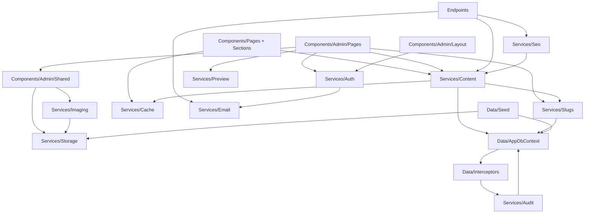

# RSD — Module Reference

**Version:** 1.0
**Date:** 2026-05-12
**Status:** Draft for review
**Owner:** Mark Podlyashetskyi

A module-by-module map of `RSD.Web` (and the planned `RSD.Web.Tests`). For each module: what it is responsible for, what types it exposes, what it depends on, what depends on it, and the conventions specific to it.

This document complements:
- [`architecture.md`](architecture.md) — the high-level system view (containers, components, decisions).
- [`docs/superpowers/specs/2026-05-12-backend-and-admin-design.md`](../docs/superpowers/specs/2026-05-12-backend-and-admin-design.md) — the implementation specification with phasing.

Modules marked **EXISTING** are in the codebase today. Modules marked **PLANNED** are introduced during Phases 1–5 of the implementation plan.

---

## Module map

```
RSD.Web/
├── Components/
│   ├── Layout/                       EXISTING — public site shell
│   ├── Pages/                        EXISTING — public top-level pages
│   ├── Sections/                     EXISTING — composable public sections
│   ├── Shared/                       EXISTING — public UI primitives
│   ├── Admin/                        PLANNED — admin panel UI
│   ├── App.razor                     EXISTING
│   ├── Routes.razor                  EXISTING
│   └── _Imports.razor                EXISTING
├── Data/                             PLANNED — persistence layer
│   ├── AppDbContext.cs
│   ├── Entities/
│   ├── Configurations/
│   ├── Interceptors/
│   ├── Migrations/
│   └── Seed/
├── Services/                         PLANNED — application services
│   ├── Content/
│   ├── Storage/
│   ├── Imaging/
│   ├── Slugs/
│   ├── Audit/
│   ├── Email/
│   ├── Cache/
│   ├── Auth/
│   ├── Preview/
│   └── Seo/
├── Endpoints/                        PLANNED — minimal API endpoints
├── Styles/                           EXISTING — Tailwind input + globals
├── wwwroot/                          EXISTING — static assets + uploads volume
├── Program.cs                        EXISTING (will be expanded)
└── appsettings*.json                 EXISTING (will be expanded)

RSD.Web.Tests/                        PLANNED — xUnit + Testcontainers
├── Unit/
└── Integration/
```

---

## 1. Presentation modules

### 1.1 `Components/Layout/` — public site shell · **EXISTING**

**Purpose:** Top-level layout for every public-facing page. Renders the global header (Navbar) and footer; provides the `@Body` slot for page content.

**Key files:**
- `MainLayout.razor` — `@inherits LayoutComponentBase`, renders `Navbar`, `@Body`, `Footer`.
- `Navbar.razor` / `Navbar.razor.cs` — main navigation, mobile menu toggle, brand link.
- `Footer.razor` — footer copy, social links, copyright line.

**Depends on:** `Components/Shared/Button`, `wwwroot/images/`, `Components/Sections/Shared/SocialLinks` (when wired up).

**Conventions:** `@inherits LayoutComponentBase` stays in `.razor` (allowed exception in `CLAUDE.md`). All other directives go in code-behind. Navbar uses `aria-expanded` for the mobile menu and `aria-current="page"` for the active link.

**Future evolution:** Once the admin is in place, `Navbar` reads social-link URLs from the DB via `SocialLinkService` (Phase 2). The footer reads `ContactPointService` to populate the address block.

### 1.2 `Components/Pages/` — public top-level pages · **EXISTING**

**Purpose:** One Razor page per route on the public site. Pages compose sections; they hold no business logic of their own.

**Key files:**

| File | Route | Composes |
|---|---|---|
| `Home.razor` | `/` | Home `HeroSection`, `WhyChooseUsSection`, `TestimonialsSection`/`TestimonialsCarouselSection`, `ProductsListSection`, `CasesGridSection`, `CtaSection` |
| `About.razor` | `/about` | About `HeroSection`, `MissionSection`, `ValuesSection`, `ManagementSection`, `TeamSection`, `PartnersSection` |
| `Services.razor` | `/services` | Services `FeaturesSection`, `TechStackSection`, `CtaSection` |
| `ServiceDetail.razor` (+ `.cs`) | `/services/{slug}` | Detail page composed from Article + Detail sections |
| `Products.razor` | `/products` | Products `HeroSection`, `ProductsListSection`, `CtaSection` |
| `ProductDetail.razor` (+ `.cs`) | `/products/{slug}` | Detail composed from Detail/* cards |
| `Cases.razor` | `/cases` | Cases `HeroSection`, `CasesGridSection`, `CtaSection` |
| `CaseDetail.razor` (+ `.cs`) | `/cases/{slug}` | Detail composed from Detail/* cards |
| `Blog.razor` | `/blog` | Blog `HeroSection`, `PostsGridSection`, `CtaSection` |
| `BlogDetail.razor` (+ `.cs`) | `/blog/{slug}` | Article composed from Article/* sections |
| `Contact.razor` | `/contact` | Contact `HeroSection`, `ContactSection` (with form) |
| `Error.razor` | `/Error` | Generic exception page |

**Depends on:** `Components/Sections/`, `Components/Layout/`.

**Conventions:** Pages are markup-only when they have no logic, or split into `.razor` + `.razor.cs` when they need a `[Parameter] public string Slug { get; set; }` and detail loading. Detail pages will, post-Phase-3, inject the relevant content service and call `await Service.GetBySlugAsync(Slug)` in `OnParametersSetAsync`.

**Future evolution:** Detail pages today render hard-coded sample data scoped to one demo slug each. Phases 2/3/4 replace those with DB lookups via the content services. Pages that 404 unknown slugs today will continue to 404 (via `NotFoundException` → `Error.razor`).

### 1.3 `Components/Sections/` — composable public sections · **EXISTING**

**Purpose:** Self-contained, visually distinct slices of a page. Each section knows how to render itself given its data; pages compose sections without knowing their internals.

**Subfolders:**

| Folder | Contents |
|---|---|
| `Home/` | `HeroSection`, `WhyChooseUsSection`, `TestimonialsSection`, `TestimonialsCarouselSection` |
| `About/` | `HeroSection`, `MissionSection`, `ValuesSection`, `ManagementSection`, `TeamSection`, `PartnersSection` |
| `Services/` | `HeroSection`, `FeaturesSection`, `TechStackSection` |
| `Products/` | `HeroSection` |
| `Cases/` | `HeroSection` |
| `Blog/` | `HeroSection`, `PostsGridSection` |
| `Contact/` | `HeroSection`, `ContactSection` (form) |
| `Detail/` | `HeroSection`, `IdentityBar`, `MetaCard`, `BulletListCard`, `ChallengeCard`, `TechPillsCard`, `StatCallouts`, `TestimonialCard`, `TwoColumnTextSection` — used by Case/Product/Service detail pages |
| `Article/` | `ArticleHeaderSection`, `ArticleBodySection`, `ArticleSubsection`, `FeaturedImageSection`, `GallerySection`, `StatsRow` — used by Blog detail and Service detail |
| `Shared/` | `CtaSection`, `CasesGridSection`, `ProductsListSection` — reused across multiple pages |

**Depends on:** `Components/Shared/` primitives, `wwwroot/images/`. Post-Phase-3, depends on the relevant content services to fetch live data.

**Conventions:**
- Today each section holds its sample data internally in its `.razor.cs`. Post-DB-wiring, each section either receives data via `[Parameter]` or fetches via service in `OnInitializedAsync`. Sections that own their data fetch keep it; sections that take data from the parent page (e.g. detail-page Detail/* cards) stay parameter-driven.
- All `` tags eventually flow through `Components/Admin/Shared/ResponsiveImage` (despite the folder name, it's a public-side helper that also lives in admin shared).

### 1.4 `Components/Shared/` — public UI primitives · **EXISTING**

**Purpose:** Brand-styled building blocks reused across sections.

**Key files:**
- `Button.razor` / `Button.razor.cs` — primary/secondary/ghost button variants; renders `<a>` or `<button>` depending on `Href`.
- `Badge.razor` / `Badge.razor.cs` — chip/pill with background + text color classes.
- `IconChip.razor` / `IconChip.razor.cs` — icon-in-circle.
- `SectionHeader.razor` / `SectionHeader.razor.cs` — eyebrow + heading + subheading block.
- `SectionContainer.razor` — wraps a section with consistent vertical padding and max-width.

**Depends on:** Tailwind utility classes only.

**Conventions:** Every primitive has a `[Parameter] AdditionalClasses` or `CssClass` escape hatch; never use inline styles. `type="button"` on every non-submit button.

### 1.5 `Components/Admin/Layout/` — admin shell · **PLANNED (Phase 1)**

**Purpose:** Top-level layout for every `/admin/*` route. Enforces auth, renders sidebar + top bar, provides the `@Body` slot for admin pages.

**Key files:**
- `AdminLayout.razor` / `.razor.cs` — `@inherits LayoutComponentBase`, `@attribute [Authorize(Roles = "Admin")]`, redirects unauthenticated visitors to `/admin/login`.
- `AdminNavbar.razor` — top bar with user email, "View site ↗", sign-out.
- `AdminSidebar.razor` — grouped navigation (Content / Operations), highlights active route via `aria-current="page"`.

**Depends on:** `Components/Admin/Shared/`, `Services/Auth/`.

**Conventions:** Sidebar items are declared as a static `IReadOnlyList<AdminNavItem>` (record) in `AdminSidebar.razor.cs` — adding a new section is one list entry.

### 1.6 `Components/Admin/Pages/` — admin pages · **PLANNED (Phases 1–5)**

**Purpose:** One folder per entity (and per special view). Each entity folder has at minimum a `List` and an `Edit` page.

**Subfolders introduced per phase:**

| Phase | Subfolders |
|---|---|
| 1 | `Login/`, `ForgotPassword/`, `ResetPassword/` |
| 2 | `Testimonials/`, `Team/`, `Partners/`, `Values/`, `Stats/`, `Tech/`, `Contact/` (entity), `Inbox/` |
| 3 | `Blog/`, `Cases/`, `Products/`, `Services/` (list + header-only edit) |
| 4 | Bodies wired into existing Blog/Cases/Products/Services edit pages |
| 5 | `Audit/`, `Trash/`, `Media/`, `Users/` |

**Standard per-entity folder shape:**
```
Components/Admin/Pages/Blog/
├── BlogList.razor              + .razor.cs   route /admin/blog
├── BlogEdit.razor              + .razor.cs   routes /admin/blog/new and /admin/blog/{id:guid}
└── BlogBodyEditor.razor        + .razor.cs   sub-component used by BlogEdit (Phase 4)
```

**Depends on:** `Services/Content/`, `Components/Admin/Shared/`, `Services/Slugs/`, `Services/Storage/`.

**Conventions:** Edit pages call the relevant content service for load/save; no `AppDbContext` injection here. `IDisposable` cancellation tokens are owned by the page and disposed in `Dispose`.

### 1.7 `Components/Admin/Shared/` — admin UI primitives · **PLANNED (Phases 1–5)**

**Purpose:** Reusable admin building blocks. The admin folder is feature-rich; this is where the bulk of the bespoke logic lives.

**Components and the phase they ship in:**

| Component | Ships | Responsibility |
|---|---|---|
| `AdminDataTable<T>` | 1 | Paginated, sortable, filterable table over `IQueryable<T>` or `IReadOnlyList<T>` |
| `StatusBadge` | 1 | Colored chip for `ContentStatus` |
| `SlugField` | 1 | Title-derived slug input with lock toggle and uniqueness check on blur |
| `ImageUploader` | 1 | Drag-and-drop image upload, progress, preview, remove |
| `ResponsiveImage` | 1 | `<picture>`/`` that picks the right variant based on `ImageRole` |
| `ConfirmDialog` | 1 | Modal confirm with optional typed-confirmation requirement |
| `Toast` / `ToastHost` | 1 | Success/error toasts via a cascading service |
| `SeoMetaPanel` | 3 | Sticky right-rail SEO fields (meta title/description, OG image) |
| `RepeaterField<TRow>` | 4 | Add/remove/reorder a list of typed rows; renders a sub-form per row |
| `BlockListEditor` | 4 | Drag-and-drop list of polymorphic `ArticleBlock` items with type palette |
| `RichTextEditor` | 4 | Quill-based WYSIWYG via JS interop; emits sanitizable HTML |
| `AuditDiffViewer` | 5 | Pretty-prints a JSON diff for an audit log row |

**Depends on:** Tailwind + Flowbite primitives; JS interop modules under `wwwroot/js/admin/`.

**Conventions:**
- Generic components use the `<T>` constraint that matches the entity contract; never `object`.
- Components that own JS interop wrap their `IJSObjectReference?` and dispose in `IAsyncDisposable`.
- `RichTextEditor` accepts a `[Parameter] EventCallback<string> ValueChanged` that fires sanitized HTML, never raw HTML.

---

## 2. Endpoints module

### 2.1 `Endpoints/` — minimal API endpoints · **PLANNED**

**Purpose:** Non-Blazor HTTP handlers for routes that should not be Razor components — typically because they emit non-HTML responses or need to be cheap and cache-friendly.

**Key files:**

| File | Route | Ships | Purpose |
|---|---|---|---|
| `ContactSubmitEndpoint.cs` | `POST /api/contact` | 2 | Receive contact-form posts, honeypot check, rate limit, insert `ContactSubmissions`, fire-and-forget `IEmailSender` |
| `SitemapEndpoint.cs` | `GET /sitemap.xml` | 5 | Stream the published-content sitemap; cached with output cache |
| `RobotsEndpoint.cs` | `GET /robots.txt` | 5 | Render robots.txt from configuration |

**Depends on:** `Services/Content/`, `Services/Email/`, `Services/Seo/`.

**Conventions:**
- Minimal API style with primary-constructor injected services (`.MapPost("/api/contact", static (ContactSubmitRequest req, ContactSubmitHandler h) => h.HandleAsync(req))`).
- Handlers are classes with one public method; live alongside the endpoint module so the routing surface is one file.
- All inbound DTOs are records with `required` fields; data-annotation validation runs via filter.

---

## 3. Application service modules

All service modules follow a common shape:

- `IThingService` interface exposing the public contract.
- One concrete implementation class with primary-constructor DI.
- Pure helpers as `private static` methods.
- No nullable returns for business operations; use `Result<T>` or `[]`/empty objects.
- One DI registration per module in `Program.cs` via an extension method (`services.AddRsdContent()`, etc.).

### 3.1 `Services/Content/` — content services · **PLANNED (Phases 2–4)**

**Purpose:** CRUD operations for every content entity. The only layer that touches `AppDbContext` for content reads/writes.

**Generic contract** (one per entity that has a list view):

```csharp
public interface IContentService<TListItem, TDetail, TUpsert>
{
    Task<IReadOnlyList<TListItem>> ListAsync(ContentQuery query, CancellationToken ct);
    Task<TDetail?> GetByIdAsync(Guid id, CancellationToken ct);
    Task<TDetail?> GetBySlugAsync(string slug, bool includeDrafts, CancellationToken ct);
    Task<Result<Guid>> CreateAsync(TUpsert input, CancellationToken ct);
    Task<Result<Unit>> UpdateAsync(Guid id, TUpsert input, CancellationToken ct);
    Task<Result<Unit>> PublishAsync(Guid id, CancellationToken ct);
    Task<Result<Unit>> UnpublishAsync(Guid id, CancellationToken ct);
    Task<Result<Unit>> ArchiveAsync(Guid id, CancellationToken ct);
    Task<Result<Unit>> SoftDeleteAsync(Guid id, CancellationToken ct);
    Task<Result<Unit>> RestoreAsync(Guid id, CancellationToken ct);
}
```

`ContentQuery` is a record carrying pagination, status filter, search text, and order.

**Files (one per entity):**
- `BlogService.cs` / `IBlogService.cs`
- `CaseService.cs` / `ICaseService.cs`
- `ProductService.cs` / `IProductService.cs`
- `ServiceService.cs` / `IServiceService.cs`
- `TestimonialService.cs` / `ITestimonialService.cs`
- `TeamMemberService.cs` / `ITeamMemberService.cs`
- `PartnerService.cs` / `IPartnerService.cs`
- `ValueService.cs` / `IValueService.cs`
- `MissionStatService.cs` / `IMissionStatService.cs`
- `TechStackService.cs` / `ITechStackService.cs`
- `ContactPointService.cs` / `IContactPointService.cs`
- `MessengerLinkService.cs` / `IMessengerLinkService.cs`
- `SocialLinkService.cs` / `ISocialLinkService.cs`
- `ContactSubmissionService.cs` / `IContactSubmissionService.cs`

Plus shared types:
- `ContentQuery.cs` (record)
- `Result.cs` (`record Result<T>(bool Ok, T? Value, string Error)` + `Unit` sentinel)
- `Mappers/` — pure static mappers between entity ↔ DTO records (per entity).

**Depends on:** `Data/AppDbContext`, `Services/Slugs/`, `Services/Cache/`, `Services/Storage/` (when an entity owns a file refcount).

**Depended on by:** `Components/Admin/Pages/`, `Components/Pages/` (post-wiring), `Endpoints/`.

**Conventions:**
- Each service method opens a single transaction (`SaveChangesAsync` is the unit of work); `AuditSaveChangesInterceptor` writes audit rows inside the same transaction automatically.
- After successful save, services call `IPublicPageCache.EvictForAsync<TEntity>(id)` to invalidate cached output.
- `GetBySlugAsync(slug, includeDrafts: false)` is the read path for public pages; `includeDrafts: true` is used only by the preview route.

### 3.2 `Services/Storage/` — file storage abstraction · **PLANNED (Phase 1)**

**Purpose:** Persist binary files; return back a stable path. Hide whether storage is disk, S3, or Azure Blob from every caller.

**Public API:**
```csharp
public interface IFileStorage
{
    Task<StoredFile> SaveAsync(Stream content, string suggestedFileName, string contentType, CancellationToken ct);
    Task DeleteAsync(string path, CancellationToken ct);
    Task<Stream> OpenReadAsync(string path, CancellationToken ct);
    string GetPublicUrl(string path);
}

public record StoredFile(string Path, long Bytes, string ContentType);
```

**Implementations:**
- `LocalDiskFileStorage` — writes under a configured root (`wwwroot/uploads/`), uses `Path.Combine` with sanitized segments; returns paths relative to `wwwroot`.

**Depends on:** Filesystem; configuration (`Storage:LocalRoot`).

**Depended on by:** `Services/Imaging/`, `Components/Admin/Shared/ImageUploader`, `Services/Content/` (where service holds the path).

**Conventions:** Paths are always forward-slash, always relative to `wwwroot`; never include `../`. File name sanitization is internal — callers pass user-supplied names freely.

### 3.3 `Services/Imaging/` — image processing pipeline · **PLANNED (Phase 1)**

**Purpose:** On upload, generate WebP variants at small/medium/large sizes; sanitize SVGs; record variants on `UploadedFiles`.

**Public API:**
```csharp
public interface IImageProcessor
{
    Task<ProcessedUpload> ProcessAsync(Stream original, string originalFileName, string contentType, CancellationToken ct);
}

public record ProcessedUpload(
    StoredFile OriginalFile,
    IReadOnlyList<ImageVariant> Variants);
```

**Implementations:**
- `ImageSharpProcessor` — uses SixLabors.ImageSharp; reads `Imaging:Variants` from config; emits WebP at quality 82.
- `SvgSanitizer` (internal) — applied for `image/svg+xml`; uses `Ganss.Xss` configured for SVG.

**Depends on:** `Services/Storage/`, configuration (`Imaging:Variants`, `Imaging:WebPQuality`).

**Depended on by:** `Components/Admin/Shared/ImageUploader`.

**Conventions:** No upscaling — if original < target width, that variant is just the original re-encoded as WebP. Width-first; height auto. Preserves EXIF orientation. Strips other EXIF for privacy.

### 3.4 `Services/Slugs/` — slug generation · **PLANNED (Phase 1)**

**Purpose:** Generate URL-safe slugs from titles, ensure uniqueness per entity table.

**Public API:**
```csharp
public interface ISlugger
{
    string Slugify(string source);
    Task<string> GenerateUniqueAsync<TEntity>(string source, Guid? currentId, CancellationToken ct) where TEntity : ContentEntity;
    Task<bool> IsAvailableAsync<TEntity>(string slug, Guid? currentId, CancellationToken ct) where TEntity : ContentEntity;
}
```

**Implementations:**
- `Slugger` — transliterates Unicode → ASCII (`Slugify.NET` or in-house Unidecode-lite), lowercases, replaces non-word chars with `-`, collapses repeated dashes, trims. Uniqueness check queries the relevant table for an existing non-deleted row and suffixes `-2`, `-3`, … until free.

**Depends on:** `Data/AppDbContext`.

**Depended on by:** `Services/Content/`, `Components/Admin/Shared/SlugField`.

**Conventions:** `Slugify` is pure (`private static` after transliteration step) and unit-tested heavily. `GenerateUniqueAsync` is the only async path.

### 3.5 `Services/Audit/` — audit log · **PLANNED (Phase 1)**

**Purpose:** Record who did what to which entity when; expose the log for admin viewing.

**Public API:**
```csharp
public interface IAuditLog
{
    Task<IReadOnlyList<AuditLogEntry>> ListAsync(AuditQuery query, CancellationToken ct);
}

public record AuditQuery(string? UserId, string? EntityType, string? Action, DateOnly? From, DateOnly? To, int Page, int PageSize);
```

**Implementations:**
- `AuditLog` — read-only adapter over `AppDbContext.AuditLogEntries`.
- `AuditSaveChangesInterceptor` (in `Data/Interceptors/`) — the writer. Captures entity changes during `SaveChanges`, emits one `AuditLogEntries` row per affected entity, with a minimal JSON diff. Determines `Action` from `EntityState` + status transitions.

**Depends on:** `Data/AppDbContext`, `IHttpContextAccessor` (to fetch current user from claims).

**Depended on by:** `Components/Admin/Pages/Audit/`, every service indirectly (via the interceptor).

**Conventions:** Diff is minimal — only changed fields. Sensitive properties (password hashes, security stamps) are excluded by name. Reads are cheap; writes happen in the same transaction as the entity change.

### 3.6 `Services/Email/` — email sending · **PLANNED (Phase 1)**

**Purpose:** Send transactional emails (password reset, user invite, contact-form notification).

**Public API:**
```csharp
public interface IEmailSender
{
    Task SendAsync(EmailMessage message, CancellationToken ct);
}

public record EmailMessage(string To, string Subject, string HtmlBody, string? TextBody = null);
```

**Implementations:**
- `SmtpEmailSender` — wraps `MailKit.Net.Smtp.SmtpClient`; reads host/port/credentials/from-address from config.
- `LoggingEmailSender` — development binding; writes to `ILogger` and emits a fake "sent" event for tests.

**Helpers:**
- `EmailTemplates/` — record-based templates: `ForgotPasswordTemplate`, `UserInviteTemplate`, `ContactSubmissionTemplate`. Each has a `Render()` that returns `(Subject, Html, Text)`.

**Depends on:** Configuration (`Email:Smtp:*`, `Email:From`).

**Depended on by:** `Services/Auth/` (forgot-password, invite), `Endpoints/ContactSubmitEndpoint`.

**Conventions:** All public-facing email content lives in `EmailTemplates/`, not inline strings. No HTML concatenation — templates use string interpolation against records.

### 3.7 `Services/Cache/` — output cache invalidation · **PLANNED (Phase 1, fully wired Phase 5)**

**Purpose:** Wrap `IOutputCacheStore` with a typed convenience surface that's easy to evict from services after a save.

**Public API:**
```csharp
public interface IPublicPageCache
{
    Task EvictForAsync<TEntity>(Guid id, CancellationToken ct) where TEntity : ContentEntity;
    Task EvictListAsync<TEntity>(CancellationToken ct) where TEntity : ContentEntity;
    Task EvictAllAsync(CancellationToken ct);
}
```

**Implementations:**
- `OutputCacheAdapter` — calls `IOutputCacheStore.EvictByTagAsync($"entity:{type}:{id}")` etc.

**Depends on:** `IOutputCacheStore`.

**Depended on by:** `Services/Content/`, `Components/Admin/Pages/` (some manual invalidations).

**Conventions:** Tag naming is centralized in `CacheTags` static class (`CacheTags.Entity<T>(id)`, `CacheTags.List<T>()`); no string concatenation outside it.

### 3.8 `Services/Auth/` — authentication and bootstrap · **PLANNED (Phase 1)**

**Purpose:** ASP.NET Identity wiring, first-admin bootstrapping, user-management helpers used by the admin Users page.

**Key files:**
- `AdminUser.cs` — `record class AdminUser : IdentityUser` with `DisplayName`.
- `AdminBootstrapper.cs` — `IHostedService` that runs after migrations; reads bootstrap env vars; idempotent.
- `UserManagementService.cs` / `IUserManagementService` — invite, disable, reset-password, list. Wraps `UserManager<AdminUser>`.
- `AdminUserClaimsTransformer.cs` — adds `DisplayName` claim on auth.

**Depends on:** ASP.NET Identity, `Services/Email/` (for invite and reset emails).

**Depended on by:** `Components/Admin/Layout/`, `Components/Admin/Pages/Login`, `Components/Admin/Pages/Users`.

**Conventions:** No raw `UserManager` calls outside this module; pages go through `IUserManagementService`. Errors surface as `Result<T>`, never thrown.

### 3.9 `Services/Preview/` — preview URL signing · **PLANNED (Phase 4)**

**Purpose:** Sign and verify short-lived HMAC tokens for draft previews.

**Public API:**
```csharp
public interface IPreviewTokenSigner
{
    string Sign(PreviewClaims claims);
    Result<PreviewClaims> Verify(string token);
}

public record PreviewClaims(string EntityType, string Slug, DateTimeOffset ExpiresAt);
```

**Implementations:**
- `HmacPreviewTokenSigner` — HMAC-SHA256 of the canonicalized claims with a configured signing key.

**Depends on:** Configuration (`Preview:SigningKey`, `Preview:TtlMinutes`).

**Depended on by:** `Components/Admin/Pages/` (every Edit page; "Preview ↗" button calls `Sign`), the public `/preview/{type}/{slug}` route handler.

**Conventions:** Tokens are URL-safe base64. Rotating the signing key in config invalidates all outstanding tokens immediately. Verification is constant-time.

### 3.10 `Services/Seo/` — sitemap and robots · **PLANNED (Phase 5)**

**Purpose:** Build the sitemap XML from published entities; serve robots.txt from config.

**Public API:**
```csharp
public interface ISitemapBuilder { Task<string> BuildAsync(CancellationToken ct); }
public interface IRobotsTxtProvider { string GetRobotsTxt(); }
```

**Depends on:** Multiple `IContentService<>`s (Blog, Cases, Products, Services), configuration (`Seo:BaseUrl`, `Seo:RobotsTxt`).

**Depended on by:** `Endpoints/SitemapEndpoint`, `Endpoints/RobotsEndpoint`.

**Conventions:** Sitemap output is XML built with `XDocument`; `lastmod` is `UpdatedAt` from the entity. Cached at the endpoint level with a 60-minute TTL.

---

## 4. Data modules

### 4.1 `Data/AppDbContext.cs` · **PLANNED (Phase 1, grows each phase)**

**Purpose:** Single EF Core DbContext for the whole application.

**Shape:**
- Inherits `IdentityDbContext<AdminUser>` so Identity and content live in the same DB and one set of migrations governs both.
- One `DbSet<T>` per entity (`BlogPosts`, `Cases`, `Products`, `Services`, `Testimonials`, `TeamMembers`, `Partners`, `Values`, `MissionStats`, `TechStackItems`, `ContactPoints`, `MessengerLinks`, `SocialLinks`, `ContactSubmissions`, `AuditLogEntries`, `UploadedFiles`).
- `OnModelCreating` applies all configurations from `Data/Configurations/` via `modelBuilder.ApplyConfigurationsFromAssembly(...)`.
- Global query filter `e => !e.IsDeleted` registered on every `ContentEntity`-derived `DbSet`.
- Constructor takes `DbContextOptions<AppDbContext>` plus `AuditSaveChangesInterceptor` (registered via DI).

**Depends on:** `Microsoft.EntityFrameworkCore`, `Npgsql.EntityFrameworkCore.PostgreSQL`, `Microsoft.AspNetCore.Identity.EntityFrameworkCore`.

**Depended on by:** `Services/Content/`, `Services/Audit/`, `Services/Slugs/`, `AdminBootstrapper`.

**Conventions:** Never `track` entities for reads in services — use `.AsNoTracking()` for queries that don't update. Updates use `Update` (typed) or `Attach` + property mutation; no `Find` + naive mutation.

### 4.2 `Data/Entities/` · **PLANNED (Phase 1, expanded each phase)**

**Purpose:** One file per entity (record class). Holds the C# representation of the database row.

**Files:** see the entity list in `architecture.md` §5.2; one `.cs` per entity, plus `ContentEntity.cs`, `SeoMetadata.cs`, `UploadedFile.cs`, `ImageVariant.cs`, `AuditLogEntry.cs`, `ContactSubmission.cs`, and the typed body records (`CaseDetailFields.cs`, `ProductDetailFields.cs`, `ArticleBody.cs`, `ArticleBlock.cs` + derived block types in `ArticleBlocks/`).

**Conventions:**
- Every entity is a `record class` (mutable; EF needs property setters) with primary-constructor-style required init where applicable.
- `Guid Id` is `init`-only.
- Audit metadata (`CreatedAt`, `UpdatedAt`, `PublishedAt`) is on `ContentEntity`.
- Owned types (`SeoMetadata`) declared as plain `record class` and configured via `OwnsOne` in the configuration class.
- Polymorphic body blocks use `[JsonPolymorphic]` + `[JsonDerivedType]` so System.Text.Json round-trips them cleanly via `jsonb`.

### 4.3 `Data/Configurations/` · **PLANNED**

**Purpose:** One `IEntityTypeConfiguration<TEntity>` per entity, keeps `OnModelCreating` thin.

**Per-config typical content:**
- Primary key.
- Indexes (notably the `WHERE NOT "IsDeleted"` partial unique index on `Slug`).
- `OwnsOne(e => e.Seo)` for SEO metadata.
- `HasConversion` for `jsonb` columns — configures `System.Text.Json` serializer for body fields.
- `HasMany` / `HasOne` relationships (rare; most entities are flat).
- `HasQueryFilter(e => !e.IsDeleted)` on every `ContentEntity` subtype.

**Conventions:** Configurations don't contain seed data — that lives in `Data/Seed/`.

### 4.4 `Data/Interceptors/AuditSaveChangesInterceptor.cs` · **PLANNED (Phase 1)**

**Purpose:** Capture entity changes during `SaveChanges` and emit audit rows.

**Shape:**
- Inherits `SaveChangesInterceptor`.
- Overrides `SavingChangesAsync`.
- Iterates `ChangeTracker.Entries()` filtered to `ContentEntity` (and a couple of operational entities), builds a minimal JSON diff, determines `Action` from `EntityState` and `Status` transitions, adds `AuditLogEntries` rows to the same context — they go to the DB in the same transaction.

**Depends on:** `IHttpContextAccessor` (current user), `TimeProvider` (deterministic timestamps in tests).

**Conventions:** Never throws — failures degrade to a warning log and let the save complete (the audit is best-effort relative to the actual change). Sensitive properties (`PasswordHash`, `SecurityStamp`, `ConcurrencyStamp`) are excluded by name.

### 4.5 `Data/Migrations/` · **PLANNED (one per phase)**

**Purpose:** EF Core code-first migrations. One initial migration in Phase 1 covers the core schema; later phases add migrations for new entities and indexes.

**Conventions:** Names follow `YYYYMMDDHHMM_DescriptiveName.cs`. Migrations are reviewed by hand for destructive operations before merge. `Database.Migrate()` runs automatically on app start; can be disabled via `Database:AutoMigrate` config flag.

### 4.6 `Data/Seed/` · **PLANNED (Phase 1, grows each phase)**

**Purpose:** Populate empty DB with today's hard-coded sample data so the site doesn't go blank on first deploy.

**Shape:**
- `SeedRunner.cs` — orchestrator; runs after migrations; per-entity guard ("any rows? skip").
- One seeder per entity: `BlogPostSeeder`, `CaseSeeder`, `ProductSeeder`, `ServiceSeeder`, `TestimonialSeeder`, …
- Each seeder owns its sample data (extracted verbatim from the current `.razor.cs` sample arrays).

**Depends on:** `Data/AppDbContext`, `Services/Storage/` (to upload seed images), `Services/Slugs/`.

**Conventions:** Idempotent — re-running on a non-empty DB is a no-op per entity. Seeded images use the same paths as today's `wwwroot/images/` so the on-disk layout matches.

---

## 5. Tests module

### 5.1 `RSD.Web.Tests/` · **PLANNED (Phase 1, grows each phase)**

**Purpose:** xUnit test project; sibling project in the solution.

**Subfolders:**
- `Unit/` — pure-function and small-class tests with no IO. Targets: `Slugger`, `Sanitizer` configurations, `ImageSharpProcessor` path generation, audit diff serialization, content-status transitions, `PreviewTokenSigner` sign+verify, `EmailTemplates` rendering.
- `Integration/` — full-stack tests against a Testcontainers Postgres. Targets: each `IContentService` CRUD path, auth flows, contact-form submission end-to-end, seed idempotency, audit interceptor behavior across transactions.
- `Bunit/` (Phase 4 onwards) — Razor component tests for `BlockListEditor`, `RepeaterField`, `SlugField`, `SeoMetaPanel`, `RichTextEditor` JS interop seam.

**Depends on:** xUnit, Testcontainers (Postgres image), Bunit, FluentAssertions (allowed extra to keep test names readable), `RSD.Web` (project reference).

**Conventions:**
- Test naming: `MethodName_Scenario_Expectation` (e.g. `Slugify_CyrillicInput_TransliteratesToAscii`).
- Integration tests share a single Testcontainers Postgres per assembly via a fixture; each test runs in its own transaction that's rolled back at the end.
- No mocks of `AppDbContext`; tests use the real DB. Services with external IO (`IEmailSender`) get the `LoggingEmailSender` from production code, asserted against its recorded messages.

---

## 6. Cross-cutting infrastructure

### 6.1 `Program.cs` · **EXISTING (will grow significantly)**

**Purpose:** Application bootstrap; wires DI, middleware pipeline, and endpoints.

**Phase-by-phase additions:**
- Phase 1: `AddDbContext<AppDbContext>(...)`, `AddIdentity<AdminUser, IdentityRole>()`, `AddAuthentication(...).AddCookie(...)`, `AddAuthorization`, `AddOutputCache(...)`, `AddHostedService<AdminBootstrapper>`, `AddRsdServices()` umbrella extension, `app.UseAuthentication()`, `app.UseAuthorization()`, `app.UseOutputCache()`.
- Phase 2: register every content service implementation, contact-form endpoint mapping.
- Phase 3-4: nothing new structurally.
- Phase 5: `MapGet("/sitemap.xml", ...)`, `MapGet("/robots.txt", ...)`.

**Conventions:** Service registration is grouped into extension methods (`AddRsdContent`, `AddRsdStorage`, …) on `IServiceCollection`; `Program.cs` stays a high-level outline. CC stays ≤ 4 by definition.

### 6.2 Configuration · **EXISTING (will be expanded)**

**Purpose:** Drive environment-specific behavior without code changes.

**Files:**
- `appsettings.json` — non-secret defaults.
- `appsettings.Development.json` — dev overrides (e.g. `LoggingEmailSender` binding hint via a profile flag).
- `appsettings.Production.json` (not in repo; deployed separately) — production overrides.
- `.env` (not in repo) — secrets (`Postgres password`, `Preview:SigningKey`, `Email:Smtp:Password`, `RSD_BOOTSTRAP_ADMIN_*`).

**Sections:** `ConnectionStrings`, `Email`, `Uploads`, `Imaging`, `Preview`, `OutputCache`, `Seo`, `Database` — see spec §8.4 for the full shape.

### 6.3 `wwwroot/` · **EXISTING**

**Purpose:** Static asset root served by `MapStaticAssets()`.

**Subfolders:**
- `images/` — design assets shipped in source (brand marks, decorative illustrations, current sample-data images that will be reused by seed data).
- `js/admin/` — admin JS interop modules (`quill-interop.js`, `image-uploader.js`) (PLANNED Phase 1/4).
- `uploads/` — Docker volume mount target; user-uploaded files. **Never committed.** Added to `.gitignore` in Phase 1.

### 6.4 `RSD.Web/Dockerfile` and `docker-compose.yml` · **EXISTING (will grow)**

**Purpose:** Reproducible build and deploy.

**Phase 1 changes:**
- `docker-compose.yml` adds a `postgres:16-alpine` service with healthcheck, `pgdata` named volume, and `depends_on: { postgres: { condition: service_healthy } }` on `web`.
- `docker-compose.yml` adds an `uploads` named volume mounted on `web` at `/app/wwwroot/uploads`.
- `.env.example` added to repo with non-secret keys; `.env` stays out of repo.

**Phase 5 (optional):**
- `docker-compose.override.yml` for local-only services (e.g. mailcatcher to capture dev SMTP).

---

## 7. Dependency map

A simplified view of which modules depend on which others. Arrows point from caller to callee.



**Layering rules enforced by review:**
- Razor components never reference `AppDbContext` directly.
- Services never reference Razor components.
- `Endpoints/` may reference services but not other endpoints.
- Cross-cutting modules (`Audit`, `Cache`, `Slugs`) may be referenced by any service; they reference only `Data/` and configuration.

---

## 8. Naming and file layout conventions

- One public type per file; filename matches the type.
- `.razor` is markup-only; logic in `.razor.cs` (exception: `@inherits LayoutComponentBase`).
- Code-behind partial classes start with `#pragma warning disable S1144, S4487, S2933` per `CLAUDE.md`.
- Interfaces live alongside their implementation: `Services/Slugs/ISlugger.cs` and `Services/Slugs/Slugger.cs`.
- DI registration extension methods live one per module: `Services/Slugs/SlugsServiceCollectionExtensions.cs` exposing `IServiceCollection AddRsdSlugs(this IServiceCollection s)`.
- Tests mirror the source tree: `RSD.Web.Tests/Unit/Services/Slugs/SluggerTests.cs`.

---

## 9. How to add a new entity (quick reference)

1. **Entity class** — `Data/Entities/NewThing.cs`. Inherit `ContentEntity` if it has Status/Slug/Soft-delete; otherwise inherit nothing.
2. **Configuration** — `Data/Configurations/NewThingConfiguration.cs`. Indexes, owned types, jsonb conversions.
3. **Migration** — `dotnet ef migrations add AddNewThing`.
4. **Service** — `Services/Content/NewThingService.cs` + `INewThingService.cs`. Register in `AddRsdContent`.
5. **Seeder** — `Data/Seed/NewThingSeeder.cs`. Register in `SeedRunner`.
6. **Admin pages** — `Components/Admin/Pages/NewThing/NewThingList.razor`(+`.cs`), `NewThingEdit.razor`(+`.cs`).
7. **Sidebar entry** — add an `AdminNavItem` in `AdminSidebar.razor.cs`.
8. **Public wiring** — replace the relevant hard-coded array in `Components/Sections/.../NewThingSection.razor.cs` with a call to `INewThingService`.
9. **Tests** — unit tests for any non-trivial mapping, integration test for the CRUD path.

Every step is a localized change in one module; no cross-cutting edits required by design.
